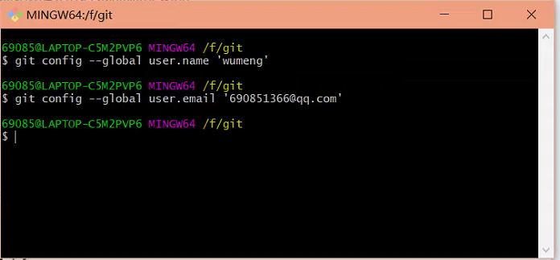
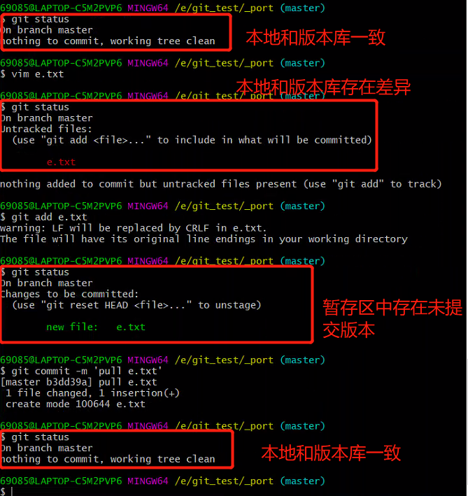
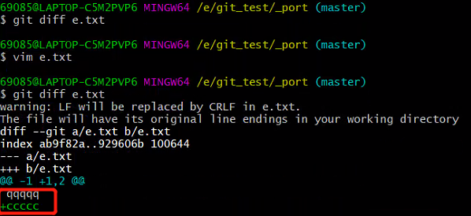
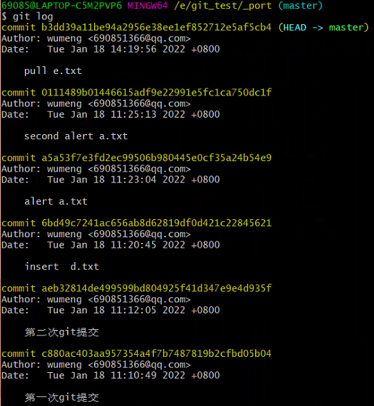
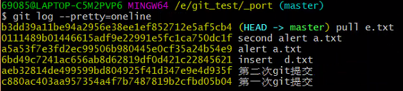
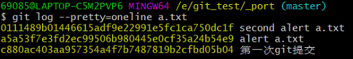
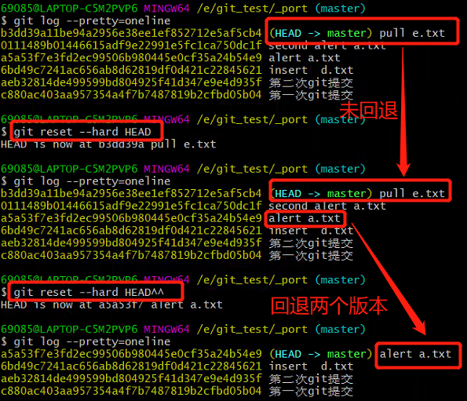
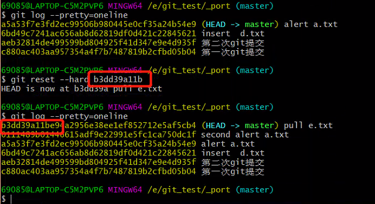
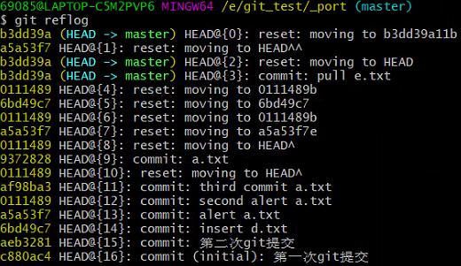
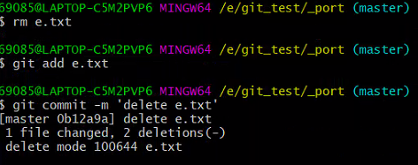

# git基本使用

## git配置

### git基本设置

  

    git config --global user.name 'username'
    git config --global user.email 'useremail@qq.com'  

## git基本操作  

### 1、创建版本库

    指定文件夹下右键 [git_bash_here] 进入控制台  

### 2、初始化版本库  

    git init  

### 3、添加文件至版本库  
  
#### 添加文件至暂存区  

    git add x.txt  

#### 提交文件至版本库  

    git commit -m '本次提交的注释说明'  

可以一次添加多个文件至暂存区，commit提交后会将暂存区中的所有文件提交至版本库  

#### 使用**status**命令查看状态  

    git status  

  

#### 使用**diff**命令查看文件差异  

    git diff e.txt  

### 4、查看版本  

#### 查看git版本库历史版本  

    git log  

  

#### 查看git版本库历史版本于一行  

    git log --pretty=oneline 

  

#### 查看指定文件历史版本于一行  

    git log --pretty=oneline a.txt  

  

### 5、版本回退  

#### 回退至上一历史版本  

    git reset --hard HEAD^  

注意：HEAD后有几个 **^** 就是回退几个 **历史版本**，HEAD与^间**不能有空格**  
  

#### 回退至指定历史版本  

    git reset --hard 版本号  
注意：回退时根据版本号进行回退，支持前后版本回退，版本号一般输入前七位即可  
  

#### 查看git的操作历史  

    git reflog  
可以根据操作历史回退版本  
  

### 6、修改文件  

#### 工作区(本地)已修改还未提交至暂存区  

    将暂存区文件同步至工作区（本地）
    git checkout -- <file> 

#### 暂存区已修改还未提交至版本库  

    撤销暂存区
    git reset HEAD <file>  
    将暂存区文件同步至工作区（本地）
    git checkout -- <file>  

#### 已提交至版本库  

    回退至上一个版本即可
    git reset --hard HEAD^  

### 7、删除文件  

    工作区删除后提交即可  
    rm e.txt
    git add e.txt
    git add -m '删除e.txt'
  
